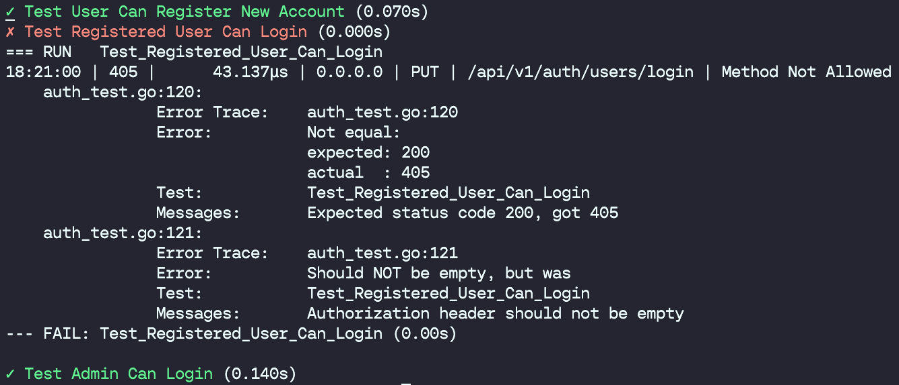

# Testpretty - Go Test Formatter

testpreety is a CLI tool designed to enhance the readability of Go test outputs. It provides a cleaner, more attractive presentation of test results by colorizing output, and distinctly marking passed and failed tests with symbols and colors. Additionally, testpretty displays detailed error messages for failed tests, making it easier to diagnose issues directly from your console.

## Features
- Colorized Output: Green checkmarks for passed tests and red crosses for failed ones.
- Detailed Errors: Shows detailed error messages for failed tests.
- Elapsed Time: Displays the duration of each test.
- Easy Integration: Works with the standard go test command.


## Installation
To install testpretty, you need to have Go installed on your machine. With Go installed, run the following command:
```sh
go install https://github.com/callamary/testpretty@latest
```

## Usage
To use testpretty, pipe the JSON output of go test into the testpretty tool:

```sh
go test -json ./... | testpretty
```

This will run your tests as usual, but the output will be processed by testpretty for improved readability.

## Example Output

### Pass


### Fail


## License
testpretty is open-sourced software licensed under the MIT license. See the LICENSE file for more details.